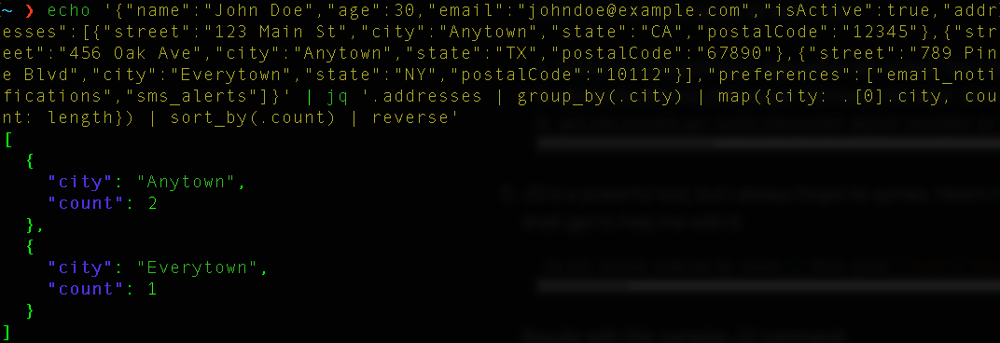
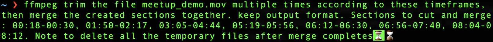

Gone are the days of memorizing the syntax for every useful shell command or diving into documentation for every possible flag. This applies to many everyday utilities — whether it's coding syntax, regex, or JQ - you name it.

With Bash, the power of AI feels different. Bash is incredibly powerful; a single command, like sed, can work wonders. Yet, remembering all the flags and syntax can be challenging. Why should we?

Long live [shell-gpt](https://github.com/TheR1D/shell_gpt).

I use this tool in so many ways, and it saves me A LOT of time (shell-gpt has a big brother shell tool called [LLM](https://github.com/simonw/llm), you can try it as well).

In a nutshell, shell-gpt is a command-line tool that uses AI to generate shell commands based on natural language descriptions. It's like having a shell expert at your fingertips.
Just _pip install_ it, and you're good to go.

The possibilities are endless. You can use it to generate complex commands, accelerate your workflows, and even as a teaching tool.
Here are a few ways I found extremely useful:

1. Write Commit msgs:
    ```bash
    git diff | sgpt "Generate git commit message, for my changes"
    ```

2. Write a readme file for my project:
   ```bash
   files-to-prompt . | sgpt -s "Create a detailed readme file"
   ```

   Will create a readme based on all the files in my repository, probably much more detailed than I would have written myself.
   Worth mentioning, [files-to-prompt](https://github.com/simonw/files-to-prompt) is an excellent tool for preparing your files for AI models, making RAG easy.

3. Generate any bash command easily:
   ```bash
   sgpt -s "In the file data.csv, grab the third column, sort it descending by count, and print the top 10"
   ```

   Results with:
   ```bash
   cut -d',' -f3 data.csv | sort | uniq -c | sort -nr | head -n 10
   ```

4. Investigate a new repository:
   ```bash
   files-to-prompt ./ | sgpt "what are these scripts doing? give me one liner per file"
   ```
   
   Easily helps me get started:
   ```
   Here’s a brief description of each file:
   
   1. bucket_size_by_prefix.py: Aggregates and outputs the size of objects in an S3 bucket by their prefixes, writing results to a CSV file.                                                                                   
   2. get_bucket_metrics_from_cw.py: Retrieves the total size of all S3 buckets in an AWS account using CloudWatch metrics and saves the data to a CSV file.                                                                   
   3. get_non_current.py: Lists noncurrent object versions in a specified S3 bucket, including their sizes and expiration dates, and writes the details to a CSV file.                                                         
   ```
   
5. JQ is a powerful tool, but I always forget its syntax. Here's how I use shell-gpt to help me with it:
   ```bash
    jq all cities ordered by count in this json: {"name":"John Doe","age":30,"email":"johndoe@example.com","isActive":true,"addresses":[{"street":"123 Main St","city":"Anytown","state":"CA","postalCode":"12345"},{"street":"456 Oak Ave","city":"Anytown","state":"TX","postalCode":"67890"},{"street":"789 Pine Blvd","city":"Everytown","state":"NY","postalCode":"10112"}],"preferences":["email_notifications","sms_alerts"]}
   ```

   Reveals this JQ operation:
   

## My Favorite Use Case

The above was just the tip of the iceberg.
Here I am, preparing my next talk about our Self-Service Platform (Highly recommended, here's a recording in [Hebrew](https://www.youtube.com/watch?v=g2QXESqjHVM) or [English](https://www.youtube.com/watch?v=pNiXGw-LLZc&t=2s).

This time, I have a 20 minutes slot for my talk, so unfortunately I have to cut a lot of content.
One of the main parts of the talk is a demo of the platform, originally 9 minutes long. Now I have to cut, trim and merge multiple parts in the video.
I know, some of you are skilled enough to do this in a video editing tool. Not me. I want to do it in bash, and I know ffmpeg can help me, but I don't remember its syntax, and have no intent to learn it right now.
Let's see how shell-gpt can help.

I'll start my prompt with the word ffmpeg to better guide the llm to what I'm looking for.
Here's my initial prompt. Notice how many different video sections I'd like to cut and merge, hinting how much time this would have taken me to do manually.
    
```bash
sgpt -s "ffmpeg trim the file meetup_demo.mov to multiple times according to these timeframes, then merge the created sections together. Preserve output format. Sections to cut and merge: 00:18-00:30, 01:50-02:17, 03:05-04:44, 05:19-05:56, 06:12-06:30, 06:56-07:40, 08:04-08:12." 
```

The result? A beautiful ffmpeg command that does exactly what I asked for. I just had to copy-paste it to my terminal and run it.
```bash
ffmpeg -i meetup_demo.mov -ss 00:18 -to 00:30 -c copy part1.mov && ffmpeg -i meetup_demo.mov -ss 01:50 -to 02:17 -c copy part2.mov && ffmpeg -i meetup_demo.mov -ss 03:05 -to 04:44 -c copy part3.mov && ffmpeg -i meetup_demo.mov -ss 05:19 -to 05:56 -c copy part4.mov && ffmpeg -i meetup_demo.mov -ss 06:12 -to 06:30 -c copy part5.mov && ffmpeg -i meetup_demo.mov -ss 06:56 -to 07:40 -c copy part6.mov && ffmpeg -i meetup_demo.mov -ss 08:04 -to 08:12 -c copy part7.mov && ffmpeg -f concat -safe 0 -i <(for f in part*.mov; do echo "file '$PWD/$f'"; done) -c copy output.mov
```

And it worked at the first shot! The resulted file output.mov was exactly what I needed. I immediately noticed another 7 temporary files in my file system, part1-7.mov. Why not ask shell-gpt to clean them for me?
```bash
[Above ffmpeg prompt] Note to delete all the temporary files after merge completes
``` 

I'll show you the result with one last trick. shell-gpt has a wonderful feature called [Shell integration](https://github.com/TheR1D/shell_gpt/tree/1.4.4?tab=readme-ov-file#shell-integration).
With it, you configure a shortcut, which spares you from the additional 'burden' of writing 'sgpt'. Just type any natural lang prompt in your terminal, click ctrl+l (or any other binding), and the magic happens:

Typing the following prompt and clicking ctrl+l:


Immediately results with:
```bash
ffmpeg -i meetup_demo.mov -ss 00:18 -to 00:30 -c copy part1.mov && ffmpeg -i meetup_demo.mov -ss 01:50 -to 02:17 -c copy part2.mov && ffmpeg -i meetup_demo.mov -ss 03:05 -to 04:44 -c copy part3.mov && ffmpeg -i meetup_demo.mov -ss 05:19 -to 05:56 -c copy part4.mov && ffmpeg -i meetup_demo.mov -ss 06:12 -to 06:30 -c copy part5.mov && ffmpeg -i meetup_demo.mov -ss 06:56 -to 07:40 -c copy part6.mov && ffmpeg -i meetup_demo.mov -ss 08:04 -to 08:12 -c copy part7.mov && ffmpeg -f concat -safe 0 -i <(for f in part*.mov; do echo "file '$PWD/$f'"; done) -c copy output.mov && rm part*.mov
```

That's it. I hope you enjoyed this post, and find shell-gpt as useful as I do.

\* <small>All the above LLM calls were made with OpenAI's gpt-4o-mini. I found this model suitable and cost-effective for all my shell needs, and I've yet to find a bash command it can't cover successfully.</small>

-----

