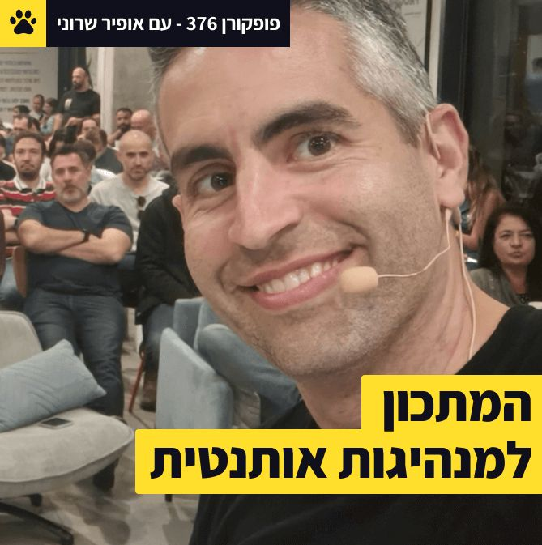

This week I had the honor of participating in Popcorn Podcast, where Lior Frenkel and myself took on the challenge of creating a practical recipe for leadership, no matter what your role is.
In five minutes a day (that is - FIVE) you can dramatically boost your influence within your team, and across your organization.
The podcast is wrapped with some of the best stories happened in my life, stories I've never told before.
It's highly practical, and I'm sure you'll find it useful. Money back guarenteed :)

[Podcast page](https://www.popcornmetrics.com/episode/episode-3-ofir-sharony)

[Spotify](https://www.popcornmetrics.com/episode/episode-3-ofir-sharony)

[Apple Music](https://www.popcornmetrics.com/episode/episode-3-ofir-sharony)

Would love to know what you thought. Enjoy.

---